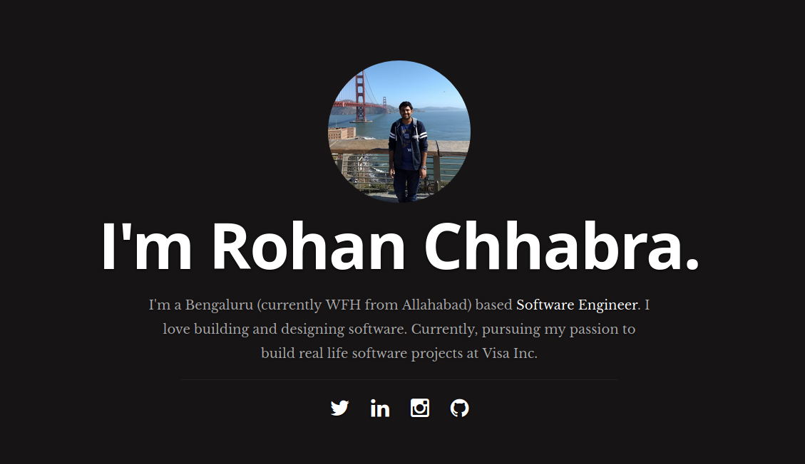

## Hey there 👋 

### Current Projects

## Course Management System
* I know it sounds too mainstream, but I decided to build this project with a friend to learn industry standard design principles.
* Hitherto, it's been an amazing learning curve for me.
* There are 4 mini-projects as part of this big project.
* Details [here](https://github.com/DevourTech)

### Currently learning
* Kafka
* Golang via projects
* Loads of in-depth JAVA
* Spring framework

